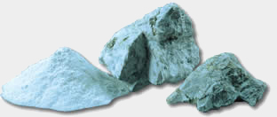

### THE BORATE STORY

Borates have long been used as a low-toxicity alternative to highly volatile, synthetic chemical pesticides. The pesticide qualities of borates have been used for at least 300 years. To stop decay or insects, builders and homeowners can apply borates to existing wood. Borates go directly on the wood and not into the soil. Borates kill termites and other wood-eating insects by poisoning the microogranisms in the insects’ digestive tracts that are needed to break down the wood’s cellulose. In other words, the termites starve to death.

Borates are also used to control ants, cockroaches, crickets and silverfish. Borates are used as a liquid spray, in granular baits and as a contact dust. Scientists believe insects die when borates enter their digestive tracts after consuming bait or grooming themselves. The borates kill the micoorganisms in the insects’ gut. So far, insects have shown no ability to develop resistance to borates.

Borates are being used more and more in the conservation of wooden structures and artifacts. The chemical diffuses deep into wood fibers to stop wood decay fungi. They are used in restoration projects from old homes to old ships. If you are concerned about exposure to toxic chemicals for your family and the environment, request that your pest control company use Nisus products in your home.

